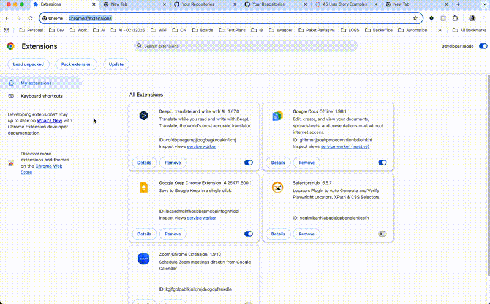

# Test-San v1.0.0 🧪

**AI-Powered QA Assistant for Azure DevOps** - Free AI Support for Test Case & User Story Analysis

---

## 📺 Demo Video

*Watch how Test-San analyzes test cases, generates test plans, and improves your QA workflow with AI assistance.*

---

## 🎯 About Test-San

Test-San is a powerful Chrome extension designed for QA professionals and testers working with **Azure DevOps**. It leverages cutting-edge AI models (both free and paid) to:

✨ **Analyze Test Cases** - Get intelligent feedback on test case quality, structure, and completeness  
📋 **Generate Test Plans** - Automatically create comprehensive test plans from user stories  
💡 **Smart Suggestions** - Receive recommendations for improvement and additional test cases  
🚀 **Seamless Integration** - Works directly within Azure DevOps without leaving your workflow  

---

## ✨ Key Features

### 🔍 Test Case Analysis
- **Intelligent Analysis**: AI-powered analysis of test cases with detailed feedback
- **Quality Scoring**: Automatic quality assessment of your test cases
- **Sentence Suggestions**: Get recommendations for clearer, more professional test case wording
- **Additional Test Cases**: Discover missing test cases based on your existing ones

### 📝 Test Plan Generation
- **Automated Planning**: Generate complete test plans from user stories
- **Structured Output**: Test cases with detailed steps, actions, and expected results
- **Test Type Classification**: Automatic categorization (functional, regression, integration, etc.)
- **Context Awareness**: Uses historical test cases for consistency

### 📚 Smart Learning
- **Historical Analysis**: Learns from your past test cases
- **Contextual Suggestions**: Provides recommendations based on your testing patterns
- **Continuous Improvement**: Gets better with usage

### 🎨 User-Friendly Interface
- **Popup Menu**: Quick access to core features
- **Side Panel**: Detailed analysis and creation interface
- **Context Menu**: Analyze selected text directly from any webpage

---

## 🚀 Getting Started

### Installation

1. **Clone or Download** the extension files
2. **Open Chrome** and go to `chrome://extensions/`
3. **Enable Developer Mode** (toggle in the top-right corner)
4. **Click "Load unpacked"** and select the extension folder
5. **Confirm installation** - The Test-San icon will appear in your Chrome toolbar

### Setup & Configuration

#### Step 1: Choose Your AI Provider

Test-San supports multiple AI providers. Each has different features and pricing:

| Provider | Type | Cost | Speed | Features |
|----------|------|------|-------|----------|
| **Groq** | Cloud | Free | ⚡ Very Fast | Recommended for speed |
| **Hugging Face** | Cloud | Free | Fast | Great alternative |
| **Google Gemini** | Cloud | Free Tier | Medium | Free tier available |
| **Together AI** | Cloud | Free Tier | Fast | Free tier available |
| **OpenAI (GPT-4)** | Cloud | Paid | Fast | Most powerful |
| **Ollama** | Local | Free | Medium | Privacy-first, no internet needed |

#### Step 2: Get an API Key

Choose your preferred provider and follow these steps:

**🟦 For Groq (Recommended):**
1. Visit: https://console.groq.com/keys
2. Create an account or log in
3. Generate an API key starting with `gsk_`
4. Copy and paste it into Test-San popup

**🤗 For Hugging Face:**
1. Visit: https://huggingface.co/settings/tokens
2. Create an access token (read permission)
3. Copy and paste it into Test-San popup

**🔷 For Google Gemini:**
1. Visit: https://makersuite.google.com/app/apikey
2. Generate a new API key
3. Copy and paste it into Test-San popup

**🤖 For Together AI:**
1. Visit: https://api.together.xyz/settings/api-keys
2. Create an API key
3. Copy and paste it into Test-San popup

**💰 For OpenAI:**
1. Visit: https://platform.openai.com/api-keys
2. Create an API key (paid plan required)
3. Copy and paste it into Test-San popup

**🏠 For Ollama (Local):**
1. Download and install: https://ollama.ai
2. Run: `ollama serve`
3. Use endpoint: `http://localhost:11434`

#### Step 3: Save Configuration

1. **Open Test-San popup** by clicking the extension icon
2. **Select your AI provider** from the dropdown
3. **Enter your API key**
4. **Click "Save"** - Your settings are encrypted and stored locally
5. **Verify** - You'll see a success message

---

## 📖 Usage Guide

### Analyzing a Test Case

1. **Open Azure DevOps** and navigate to a test case
2. **Click the Test-San icon** in your toolbar
3. **Select "📋 Test Case Analiz Et"** (Analyze Test Case)
4. **Wait for analysis** - AI will analyze the page content
5. **Review results** including:
   - Detailed analysis and feedback
   - Sentence improvement suggestions
   - Additional test case recommendations
   - Quality score

### Creating a Test Plan from User Story

1. **Open a user story** in Azure DevOps
2. **Click the Test-San icon** in your toolbar
3. **Click "📝 User Story'den Test Planı Oluştur"** (Create Test Plan from User Story)
4. **Wait for generation** - AI creates comprehensive test plan
5. **Review generated content**:
   - Test plan overview
   - Individual test cases with detailed steps
   - Expected results for each step
   - Test type classification

### Analyzing Selected Text

1. **Select any text** on a webpage related to testing
2. **Right-click** and choose **"Test Case/User Story Oluştur"**
3. **Select from context menu** to open Side Panel
4. **AI automatically analyzes** the selected content
5. **View results** in the side panel

### Accessing History

All your analyses are stored locally:
- **Test Case History**: Accessible from the side panel
- **User Story History**: Auto-save of all generated test plans
- **Privacy**: All data stays on your device - no cloud backup

---

## 🎨 User Interface

### Popup Window
The main popup provides quick access to:
- **AI Provider Selection** - Choose and configure your AI service
- **API Key Management** - Securely store your authentication
- **Quick Analysis Buttons** - One-click analysis features
- **Status Messages** - Real-time feedback on operations

### Side Panel
Detailed interface for:
- **Selected Text Analysis** - Automatic detection and analysis
- **Comprehensive Results** - Full output with formatting
- **Result History** - Access previous analyses
- **Export Options** - Save results for later use

---

## ⚙️ Configuration Details

### Manifest Features

The extension uses Chrome Manifest V3 with:
- **Background Service Worker** - Handles AI API calls and context menu operations
- **Content Scripts** - Extracts data from web pages
- **Side Panel** - Enhanced UI for detailed work
- **Context Menus** - Right-click integration
- **Storage API** - Secure credential storage

### Permissions Used

- `storage` - Save your API keys and preferences
- `tabs` - Access current webpage information
- `scripting` - Extract content from pages
- `contextMenus` - Right-click menu integration
- `host_permissions` - Connect to AI provider APIs

### Supported Host Permissions

- All URLs (for content analysis)
- Groq API (`https://api.groq.com/*`)
- Hugging Face (`https://api-inference.huggingface.co/*`)
- Google Generative AI (`https://generativelanguage.googleapis.com/*`)
- Together AI (`https://api.together.xyz/*`)
- OpenAI (`https://api.openai.com/*`)
- Ollama Local (`http://localhost:11434/*`)

---

## 🔒 Security & Privacy

### Data Protection
- ✅ **Local Storage** - Your API keys never leave your computer
- ✅ **Chrome Storage API** - Encrypted by your browser
- ✅ **No Cloud Backup** - All data remains on your device
- ✅ **No Tracking** - Complete privacy focus

### What Gets Sent to AI

When you use Test-San:
1. **Page Title** - From the current tab
2. **Page URL** - Context reference
3. **Selected Content** - Only what you choose to analyze

That's it! No personal data beyond what you explicitly submit.

### What Never Gets Stored

- ❌ Your browsing history
- ❌ Other websites' content
- ❌ Analytics or usage tracking
- ❌ Cookie data

---

## 🛠️ Troubleshooting

### "API Key Not Found" Error

**Solution:**
1. Click the Test-San icon
2. Select an AI provider from the dropdown
3. Enter your API key
4. Click "Save"
5. Try again

### "Failed to Connect" or Timeout Error

**Solutions based on provider:**

**For Cloud Providers (Groq, OpenAI, etc.):**
- Check your internet connection
- Verify your API key is correct (no extra spaces)
- Ensure your API key has the right permissions
- Check if the provider's service is operational

**For Ollama:**
- Ensure Ollama is installed and running: `ollama serve`
- Verify endpoint is: `http://localhost:11434`
- Check that Ollama service hasn't crashed

### Side Panel Not Opening

**Solution:**
1. Refresh the Azure DevOps page (F5)
2. Try right-clicking selected text again
3. Restart Chrome if issue persists

### Analysis Takes Too Long

**Try:**
- Switch to a faster provider (Groq recommended)
- Reduce the amount of text being analyzed
- Check your internet speed

---

## 🔄 API Provider Performance Comparison

| Feature | Groq | HF | Gemini | Together | OpenAI | Ollama |
|---------|------|-----|--------|----------|--------|--------|
| **Speed** | ⚡⚡⚡ | ⚡⚡ | ⚡⚡ | ⚡⚡ | ⚡⚡ | ⚡ |
| **Accuracy** | ⭐⭐⭐⭐ | ⭐⭐⭐ | ⭐⭐⭐⭐ | ⭐⭐⭐ | ⭐⭐⭐⭐⭐ | ⭐⭐⭐ |
| **Cost** | Free | Free | Free | Free | Paid | Free |
| **Setup** | Easy | Easy | Easy | Easy | Medium | Hard |
| **Privacy** | Good | Good | Fair | Good | Fair | Excellent |

---

## 📝 Supported Content

Test-San works best with:
- ✅ Azure DevOps Test Cases
- ✅ Azure DevOps User Stories
- ✅ Azure DevOps Features
- ✅ Any plain text test documentation
- ✅ Email-based test case descriptions
- ✅ Confluence pages with test content

---

## 🐛 Bug Reports & Feedback

Found an issue or have a suggestion? 

**Please provide:**
1. Description of the problem
2. Steps to reproduce
3. Your AI provider choice
4. Error messages (if any)
5. Screenshots (if helpful)

---

## 📜 Version History

### v1.0.0 (Current)
- ✨ Initial release
- 🎯 Test case analysis feature
- 📋 Test plan generation
- 🤖 Multi-provider AI support (6 providers)
- 💾 Local data storage
- 🎨 User-friendly UI
- 📱 Side panel integration
- ⚙️ Configurable settings

---

## 📚 Tips & Best Practices

### For Best Results:

1. **Provide Complete Context** - The more detailed your test case, the better the analysis
2. **Be Specific** - Clear language helps AI understand your intent
3. **Use Consistent Format** - Regular test case format produces better suggestions
4. **Review AI Output** - Always validate suggestions before using them
5. **Learn from Patterns** - The AI improves as it analyzes more of your test cases

### Recommended Setup:

- **For Speed**: Use Groq (fastest free option)
- **For Accuracy**: Use OpenAI (GPT-4) or Google Gemini
- **For Privacy**: Use Ollama (everything stays local)
- **For Balance**: Use Groq + fallback to Gemini

---

## 🤝 Contributing

Contributions are welcome! Feel free to:
- Report bugs
- Suggest features
- Improve documentation
- Share your use cases

---

## 📄 License

Test-San v1.0.0 is released with full source code access.

---

## 🎓 FAQ

**Q: Is my API key safe?**  
A: Yes! Your API key is stored locally in Chrome's encrypted storage and never sent anywhere except to the AI provider you selected.

**Q: Can I use multiple AI providers?**  
A: Yes, you can change providers anytime by updating the settings in the popup.

**Q: Does Test-San work offline?**  
A: Only Ollama works offline. Other providers require internet connection to the AI service.

**Q: Can I export the analysis results?**  
A: Currently results are displayed in the popup/side panel. You can manually copy-paste or take screenshots.

**Q: How much data can I analyze at once?**  
A: The extension limits analysis to ~1000 characters per request (for performance). Longer content is truncated.

**Q: Will my analysis history be saved?**  
A: Yes, all analyses are saved in IndexedDB locally on your device.

---

## 💡 Ideas for Future Versions

- 📤 Export results to Excel/PDF
- 🌐 Multi-language support
- 🎯 Custom analysis templates
- 📊 Analytics dashboard
- 🔗 Integration with Azure DevOps API
- 🤖 Custom model fine-tuning
- 📋 Bulk test case analysis
- 🎨 Dark mode theme

---

## 🙏 Thank You!

Thank you for using Test-San! We hope it makes your QA process more efficient and enjoyable.

**Happy Testing!** 🚀

---

  <strong>Test-San v1.0.0</strong> | AI-Powered QA Assistant Extension 
  Made with ❤️ for QA professionals

